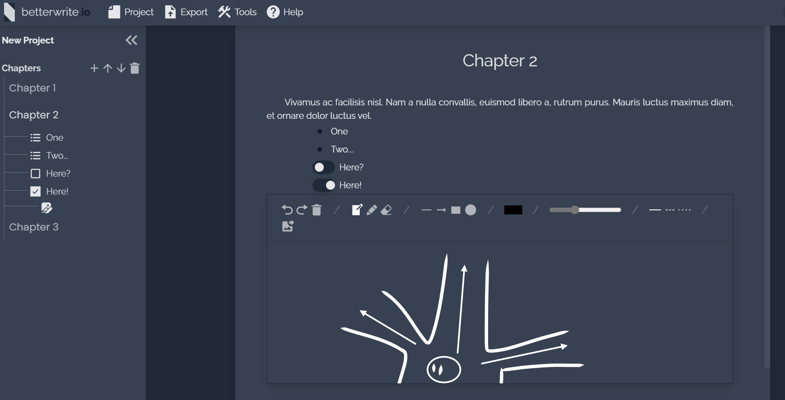
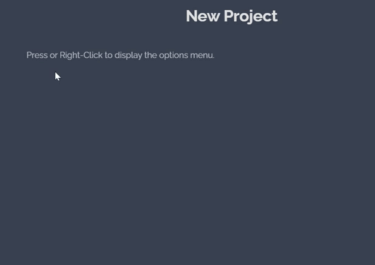
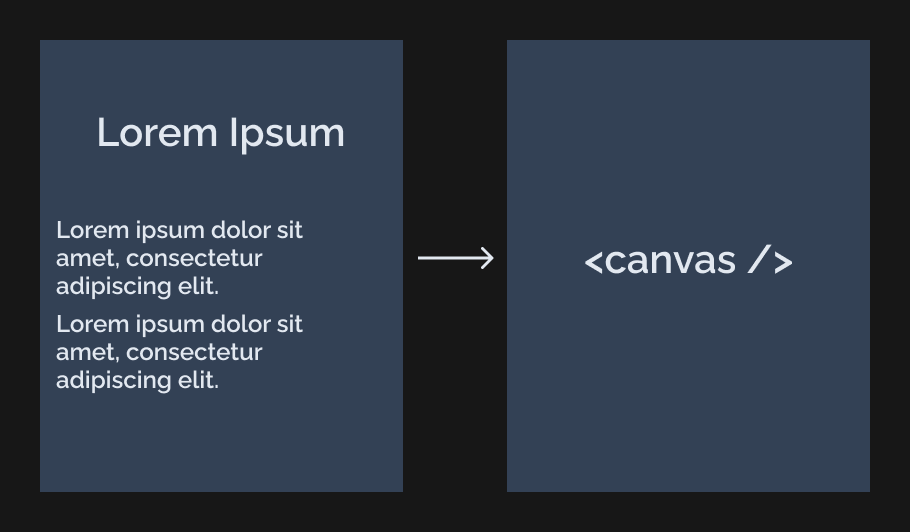
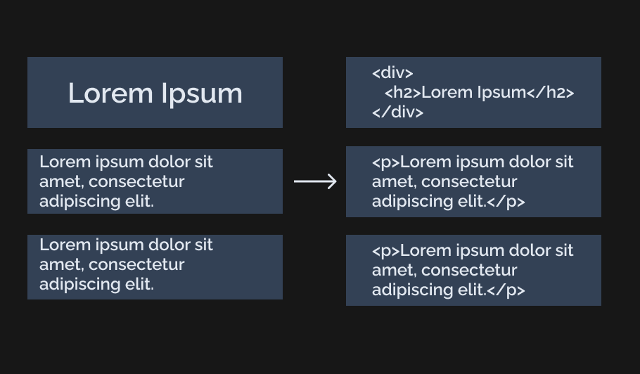
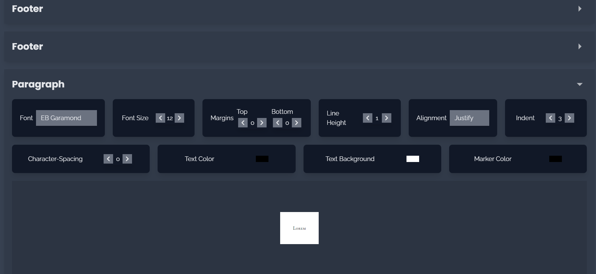
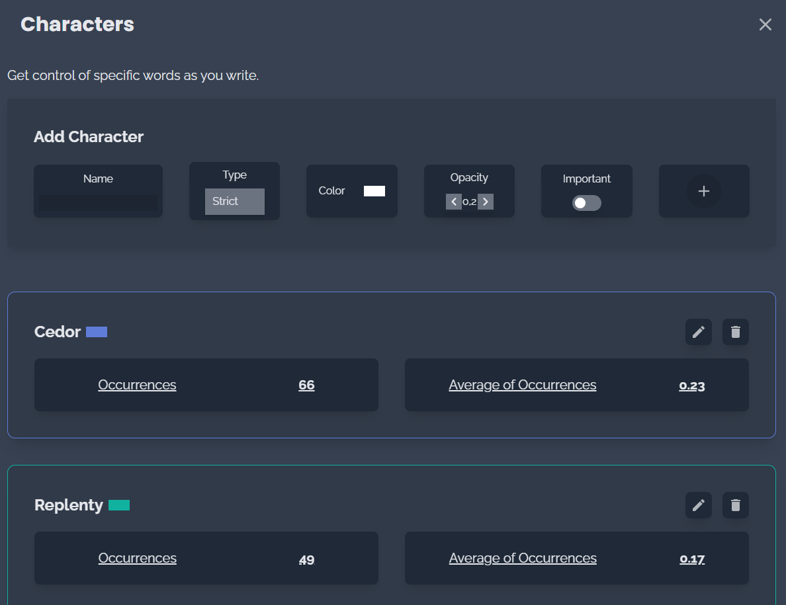
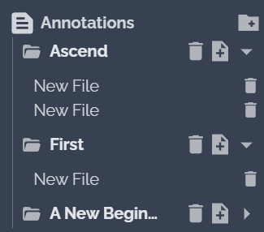
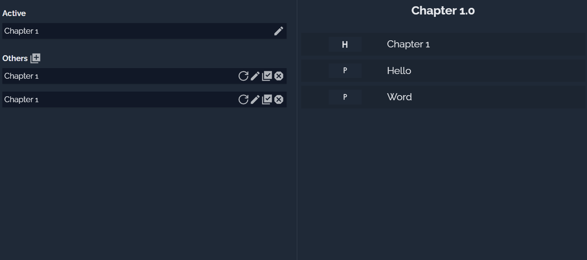
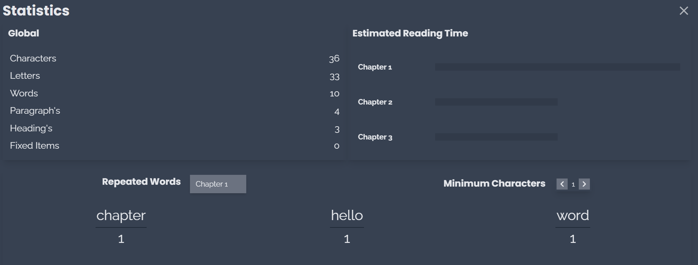

  

<h1 align="center">
betterwrite.io
</h1>
<h4 align="center">
A Modern Word Processor.
<h4>

  
  
  
  

 

# Features

- ✅ Entity-Model Editor
- ✅ Offline First
- ✅ Cloud Save
- ✅ Full Customization
- ✅ Multipurpose
- ✅ High Tracking
- ✅ Statistics in Real-Time
- ✅ Graph Control
- ✅ Plugin Friendly
- ✅ Mobile & Desktop (PWA)
- ✅ PDF, DOCX, HTML and TXT Generator

# Motivation

There are no word processors on the market that are not inextricable from the context itself. This approach makes it difficult to integrate other resources, limiting creative possibilities for writers and publishers. __Better Write__ offers an individual and reactive approach to any item that is entered in the editor.

 

  

 

# A Different Way

With **betterwrite.io**, transform your editor's appearance in a way that showcases your creativity even more. The editor offers a number of customization tools, allowing the user greater flexibility and contentment with the tool.

- Modify the editor's size and font

- Choose a background image (.gif supported)

- Transparency items for better use of the image.

- Default color themes

# Entity Model

Better Write works with the Entity Model, where each item in the editor is unique and independent of other content. This model allows the creation of resources that do not necessarily function as texts, such as Lists, Checkboxes, Images and Drawings. The generators do not need to extract data from the editor because with the Entity Model we can standardize the project data, allowing the extensions (.PDF, .DOCX, .HTML, .TXT) to work independently and a new external extensions support.

 

## Canvas Model (Common in other Word Processors)

## Entity Model

 

# Resources

Better Writer brings features beyond what traditional word processors can offer, mainly because it has a much broader purpose.

## Dynamic Customize Documents

Write without worrying about customization, leaving the hard work only for the time to finish the project.

## Relevant Characters

Get control of specific words as you write. Highlight characters in paragraphs by color and more easily find the word that matters most to you.

## Annotations

Keep your notes in an exclusive space, without interfering with the main project.

## Drafts

Don't worry about rewriting. Save your chapters as a draft in case you want to retrieve them in the future.

## Statistics

Consult in depth the current state of your project with a range of tools at your disposal.

# Changelog

Check git changelog [here](./CHANGELOG.md)