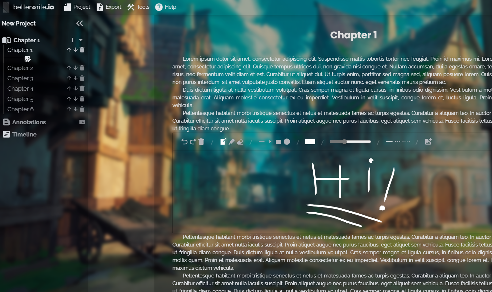

  

<h1 align="center">
betterwrite.io
</h1>
<h4 align="center">
A Open Source Word Processor
<h4>

  
  

 

# Features

- ✅ Entity-Model Editor
- ✅ Offline First
- ✅ Cloud Save
- ✅ Full Customization
- ✅ Multipurpose
- ✅ High Tracking
- ✅ Statistics in Real-Time
- ✅ Graph Control
- ✅ Plugin Friendly
- ✅ Mobile & Desktop (PWA)
- ✅ PDF, DOCX, HTML and TXT Generator

 

# Development

**Check development guide [clicking here.](./CONTRIBUTING.md)**

# Changelog

**Check git changelog [clicking here.](./CHANGELOG.md)**

# Documentation

**For full documentation, [click here.](./docs/)**