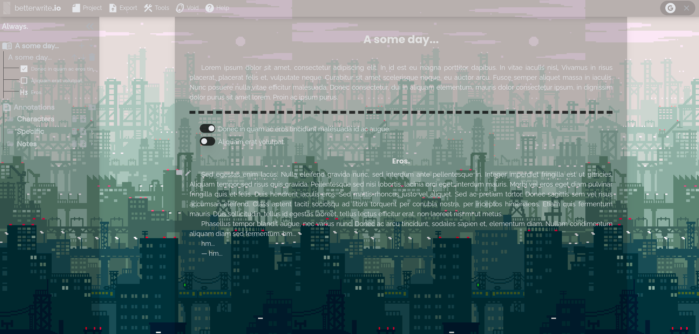
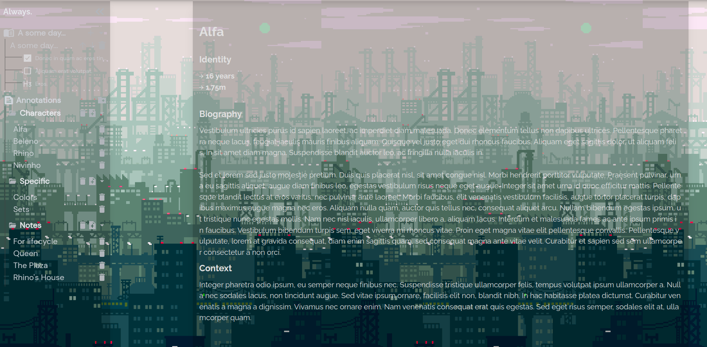
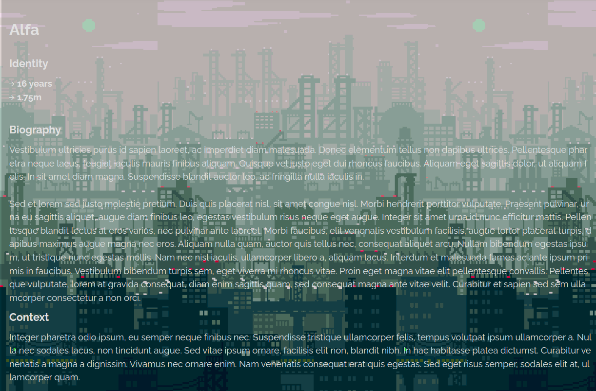
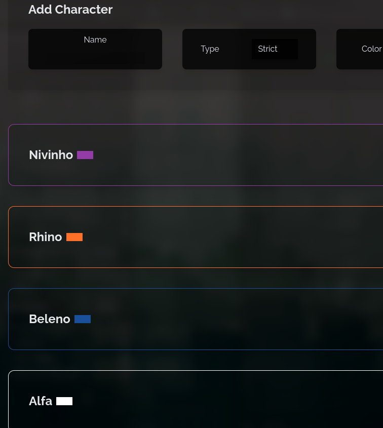
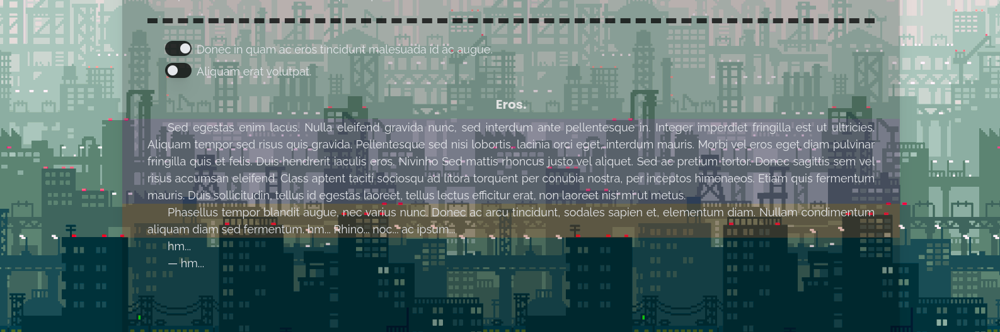
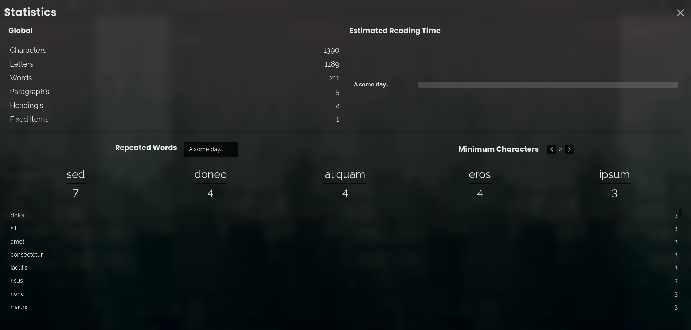
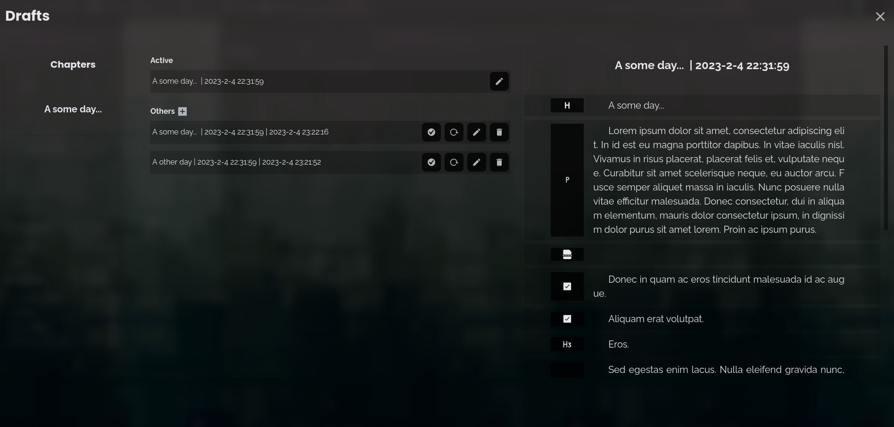

  

<h1 align="center">
betterwrite.io
</h1>
<h4 align="center">
A Creative Word Processor
<h4>

  
  

 

# Features

- ✅ Entity-Model Editor
- ✅ Offline First
- ✅ Cloud Save (Void)
- ✅ Full Customization
- ✅ Multipurpose
- ✅ High Tracking
- ✅ Statistics in Real-Time
- ✅ Graph Control
- ✅ Plugin Friendly
- ✅ Mobile & Desktop (PWA)
- ✅ PDF, DOCX, HTML, EPUB and TXT Generator

 

# An Editor for Creative Writing

Unlike traditional text flows, *betterwrite* focuses on producing an out-of-the-curve experience for writers and writing derivatives, bringing with it several additional tools to increase the flow of use. By default, the editor always tends to maintain compatibility in offline mode, allowing users to continue their work without having their workflow interfered. Furthermore, the editor is fully customizable with the main focus on emphasizing the writer's creativity and adapting all the context at his disposal.

### Annotations 

  
  

### Characters

**Characters** is a system for identifying specific words and offering some control over them, highlighting the paragraph with colors and their occurrence in the project. This system mainly allows fantasy or drama writers to have greater control of their paragraphs and handle character arcs with perfection.

  
  

### Statistics

**Statistics**

### Drafts

**Drafts**

### Other Project Types

Besides the **creative** mode, the **common** mode is available for the production of simple documents and the **only-annotations** mode for annotating day-to-day tasks and other TODO's.

# Development

**Check development guide [clicking here.](./CONTRIBUTING.md)**

# Changelog

**Check git changelog [clicking here.](./CHANGELOG.md)**

# Documentation

**For full documentation, [click here.](./docs/)**