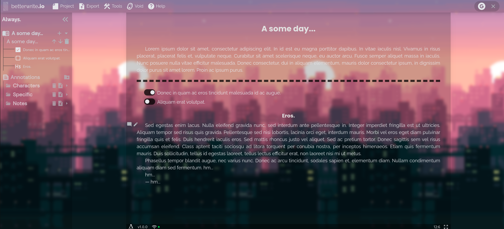

  

<h1 align="center">
betterwrite.io
</h1>
<h4 align="center">
A Creative Word Processor
<h4>

  
  

 

# Features

- ✅ Entity-Model Editor
- ✅ PDF, DOCX, HTML, EPUB and TXT Generator
- ✅ Mobile & Desktop (PWA)
- ✅ Offline First
- ✅ Cloud Save (Void)
- ✅ Local Extension (.bw)
- ✅ Full Customization
- ✅ Multipurpose
- ✅ High Tracking
- ✅ Statistics in Real-Time
- ✅ Graph Control
- ✅ Plugin Friendly
 

# An Editor for Creative Writing

Unlike traditional text flows, *betterwrite* focuses on producing an out-of-the-curve experience for writers and writing derivatives, bringing with it several additional tools to increase the flow of use:

- **Full Customization**: The editor is fully customizable with the main focus on emphasizing the writer's creativity and adapting all the context at his disposal. In addition to standard themes, *betterwrite* allows for custom backgrounds (including gifs) and the use of external fonts within the editor itself.

- **Void** is a cloud save feature aiming to be more user friendly and easy to access among other projects saved in the void. Its structure was planned not to interfere with local saves (local storage or extension).

- **Annotations** have a different editor, based on markdown, offering a more instantaneous and familiar option than the main editor, fulfilling its main purpose: annotating. Annotations do not participate in the document production flow and serve as an aid to the writer.

- **Characters** is a system for identifying specific words and offering some control over them, highlighting the paragraph with colors and their occurrence in the project. This system mainly allows fantasy or drama writers to have greater control of their paragraphs and handle character arcs with perfection.

- **Statistics** are calculated in real time, bringing relevant information about each chapter and possible points of improvement.

- **Drafts** allow you to control each chapter individually and make it possible to create alternatives for the same text, making it easier for the user if he needs to explore other alternatives for his book.

- **Corrector** serves to fix small details that can go unnoticed by a writer, facilitating the work of proofreading.

- **Insert Shortcuts** is a different tool that creates shortcuts to insert repetitive texts (such as dialog openings or names of characters or locations).

- **Voice Typing** is enabled on paragraphs and other types of text blocks, enabling a new way to build worlds and universes.

- **Substitutions** it offers the replacement of words at generation time, also allowing the insertion of italics or bold.

- **Comments**: Want to remember something specific to change in the future? Insert a comment in an entity and consult it whenever you want by clicking on the sidebar or the comment button.

- **Individual Styling**: Using the brush icon on each paragraph entity, choose styles only for the designated group of paragraphs, overriding the ones chosen in the generator's default configuration tab.

## Offline First

By default, the editor always tends to maintain compatibility in offline mode, allowing users to continue their work without having their workflow interfered. This is possible thanks to the *100% Client-Side* concept, where all the logic and use by the user is on the client side, where the role of authentication and saving in the cloud (void) does not depend on the project, and vice versa.

## Other Project Types

Besides the **creative** mode, the **common** mode is available for the production of simple documents and the **only-annotations** mode for annotating day-to-day tasks and other TODO's.

# Generators

The idea of ​​generators is simple: do whatever you need to, but only worry about your document at the end of the project. The styling of the editors (and the blocks) does not interfere with the generations as they are not based on HTML rendering, which allows the project to respect only the imposed settings.

### Browser Polyfills

All generators were designed to work from the API's offered by browsers, not requiring serveless functions or external providers. Extra features like fonts and other utilities are built into the standard application flow (like some .ttf / typeface fonts).

# Development

**Check development guide [clicking here.](./CONTRIBUTING.md)**

# Documentation

**For technical documentation, [click here.](./docs/)**

# For Developers

**For enthusiast developers, [click here.](./FOR_DEVELOPERS.md)**

# Changelog

**Check git changelog [clicking here.](./CHANGELOG.md)**