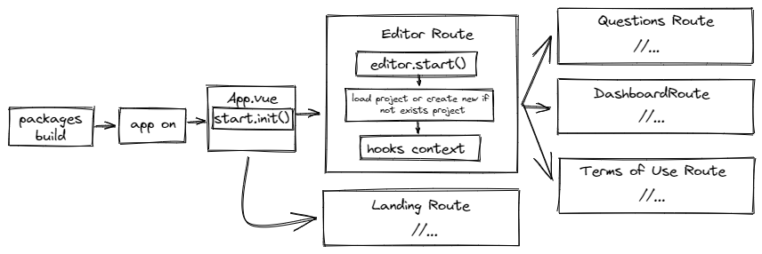
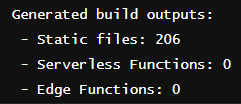

# Application Flow

The main application is in its own vue flow: after the packages are compiled, the context is started (better-write-app s/main.ts) with the plugins (from the vue itself and the native plugin initialization) and the route is created that must be called.

> Editor launcher, unlike the application launcher, creates global listeners that other application tools can adapt the results (shortcuts, for example).

> destroy() is always called when the vue hook called onBeforeUnmound() is called.

## Solutions

Below are listed some specific solutions for the application flow:

### PWA instead of Electron

Better Write stopped using `Electron` (since v0.9.0-beta.6) for the `PWA` approach. Because of the proposal to have an application that is web, desktop and mobile, PWA can supply all three types of platforms with the same code.

> The service worker file is named `sw.js` and caches all `public` files. If in doubt, refer to the `vite.config.ts` file in `better-write-app`

### Polyfills

Due to the need to use some packages that are server-side by default (like zip.js), support for native nodejs functions was implemented. You can find the script by [clicking here](https://github.com/Novout/betterwrite/blob/main/packages/better-write-app/scripts/vite.ts).

### Static Files

The application uses only static files to provide `Offline First` at all costs.

