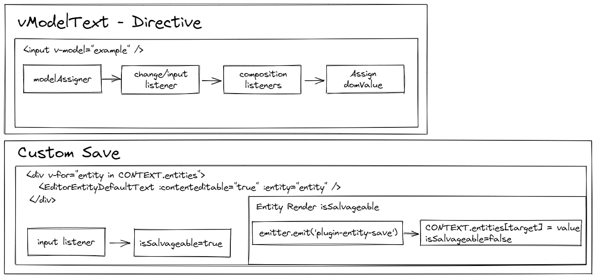

# Entity Model

Better Write works with the Entity Model, where each item in the editor is unique and independent of other content. This model allows the creation of resources that do not necessarily function as texts, such as Lists, Checkboxes, Images and Drawings. The generators do not need to extract data from the editor because with the Entity Model we can standardize the project data, allowing the extensions (.PDF, .DOCX, .HTML, .TXT) to work independently and a new external extensions support.

## Contenteditable

To more easily deal with the issue of data entry (mainly keyboard related) it was necessary to create a specific package (better-write-contenteditable-ast) to deal only with the editor and provide what is necessary for the tools that depend on it (eg document exporters). The contenteditable is an html helper that allows you to treat a specific tag as editable (similar to input). The great advantage is its adaptability and the possibility of control that the tool provides, allowing you to browse the AST in a more coherent way (and without worrying about errors in italics, for example).

> The AST itself was built only in version v3, as the editor has already gone through other ways of working before arriving at this solution.

## Reactivity

All context (both mutable and global file access) is handled directly by [pinia stores](https://pinia.vuejs.org/). Therefore, we were able to deliver a fully reactive and instant application to users' perception.

For this, it was necessary to work around some limitations, such as saving changes only when the context is blurred ([not using vue's native `v-model`](https://github.com/Novout/betterwrite/blob/main/packages/better-write-app/src/use/block/text.ts#L49)).

> Because of this alternative, some items in the editor will not directly show the interface, being mutated only when the given emitter event is.

## Annotations Editor

The annotations do not use the proprietary editor because its purpose is different from the primary focus, which made it necessary to integrate an editor that allows a different way of dealing with the necessary resources.

> Generators rely on the proprietary AST to transform the default DOM generated from contenteditable to a more readable approach, described in the [generator flow](./GENERATOR_FLOW.md) section.
