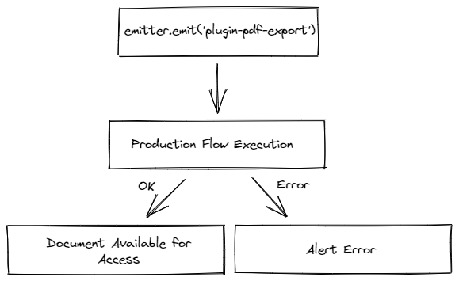
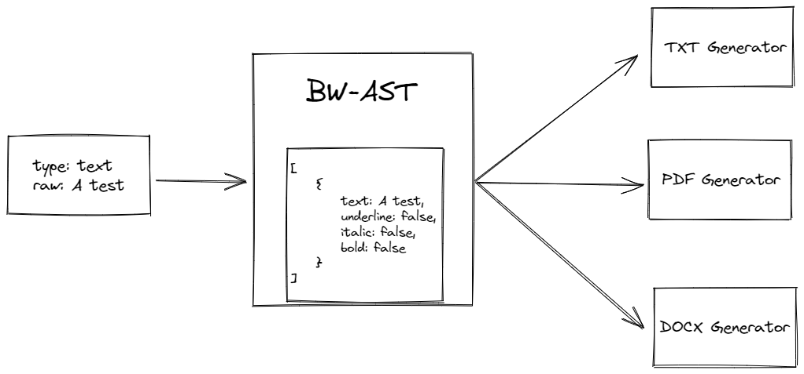

# Generator Flow

Generators do not have a core package, but each makes its own requests. The great advantage is the adaptability of emitting creation events by the core plugin (all generators are necessarily plugins as they depend on accessing their processing settings and needing access to the editor's data (not only the rendered list). 

It works by the following logic: the generation event is issued, items are processed asynchronously until the document is produced or not. In case of failure, the user is notified.

> The only feature that depends on external resources in the generators is the google fonts requests. Each generator deals with its possible lack of resource in a specific way.

> In the initial stages of development, the export of documents beyond the .PDF extension was not expected, requiring the re-implementation of certain features in the process.

## Text's

The flow of generators in the text part consists of converting them to a new list with only pertinent data (for the conversion) and making them available to the processors.

> This method converts ONLY text types (checkbox, list, the text type itself).

## Other Types

Other types that are not directly related to text processing (images and drawings, for example), depend on how the extension handles that data and whether it is possible to convert the block into the document.

> The TXT text generator fails to convert the vast majority of blocks, discarding all non-text entity types.

> Which features the word processor supports by each extension can be found in the **Help -> Questions** section.
