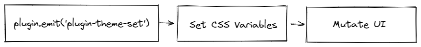

# Multi-Theme Plugin

The multi-theme plugin was built given the choice of architecture focused on customization, so the package (better-write-plugin-theme) manages to provide pre-determined themes that allow the user to change the vast majority of the editor's styling.

> By default, the chosen initial theme depends on the system presets (undefined, white or dark).



### Customization

- Modify the editor's size and font;

- Choose a background image (.gif supported);

- Transparency items for better use of the image;

- Default color themes.

### WindiCSS

Migrating from [Tailwind](https://tailwindcss.com/) to [WindiCSS](https://windicss.org/), this choice was essential to facilitate the relationship between the values ​​inserted by the theme with the semantics of the inserted classes, where each `.vue` component (or at least most of them) has its own keys for each coloring item.

> The configuration file can be found in the root of the `better-write-app` package as `windi.config.ts`.

### CSS Variables

Each theme has a list (with the same keys) and its colors that are injectable by default. The chosen theme defines which theme list will be loaded and considered by the application (class inserted in the <body>).

### Injection

To inject the css the following files were defined:

```txt
fonts.css    // Default font-face with fonts that are built locally 
inject.css   // CSS Variables of all themes (including the customizable theme)
preset.css   // CSS Reset and other utilities that do not rely on WindiCSS
```

> Some fonts are loaded locally so they don't need to occupy the service worker cache (which is already quite large by default).

> Some preset classes will be undone (if) the framework is migrated to [UnoCSS](https://github.com/unocss/unocss).