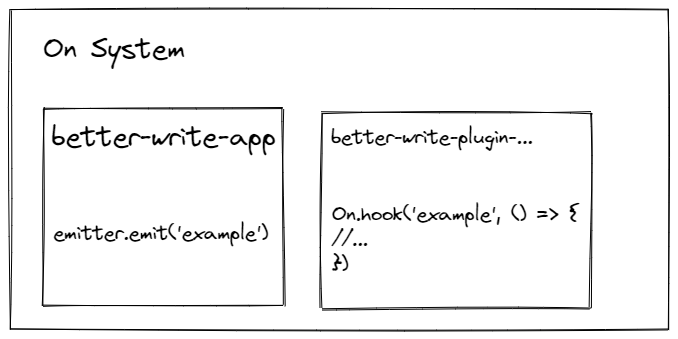
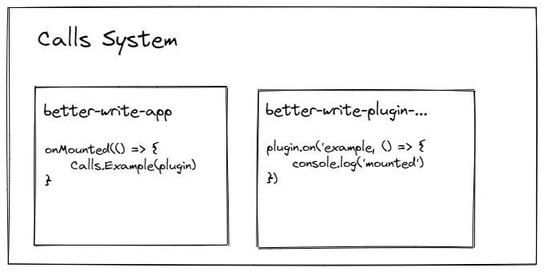

# Plugin System

The plugin system was built to suit the project's monorepo structure, allowing other packages to interact with the main application context (better-write-app).

The system consists of:

- Two vue hooks that are part of the global configuration of the vue context;

- Two own hooks to provide access to the main instance, internal hooks and reactive stores;

- Call system for packages derived from the plugin to have access to interactions (not only from the application, but also from the user) and create their own context in order to improve the intermediation of packages;

- Listening system to perform a specific action or provide a direct interaction between packets (used mainly for emitting button events).

> For convenience, packages that depend on the plugin system are defined with prefix `better-write-plugin`

> The plugin system is not designed to build plugins outside of the repository.