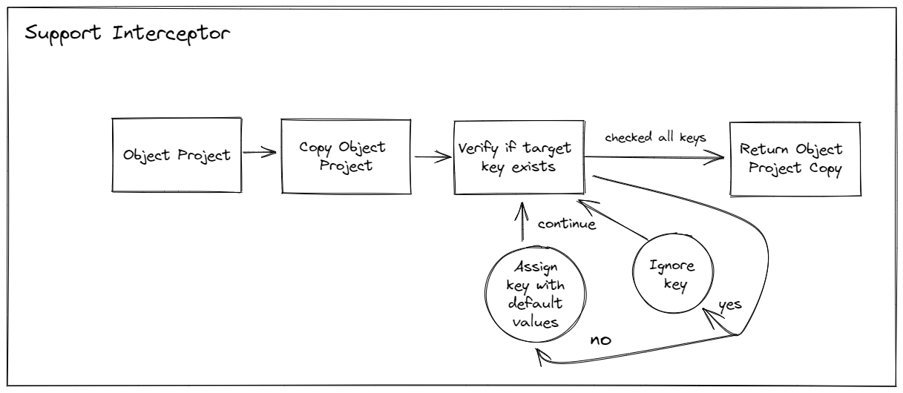

# A Project Context

To provide a better experience with the projects and follow the Offline First precepts, the project is based on a `.json` divided into usage and access categories. With this, it is possible to adapt the entire context solely on the Client-Side and offer a range of tools that do not depend on internet access or an overloaded server.

## JSON Structure

The `.json` consists of:

- **id**: Identifier used to save the project from the cloud (and understand that it is a project that belongs to the cloud). If the project has never been saved in the cloud, the identifier will be undefined;
- **project**: All data referring to the direct use of the user. Here we find everything that is inserted and that can be manipulated by user;
- **editor**: Separated exclusively for customization, it was chosen not to belong to the **project** due to performance in data access;
- **pdf**: .PDF document customization settings;
- **docx**: .DOCX document customization settings.

> PDF - DOCX configurations (and other possible future configurations) are divided in the context because it facilitates the manipulation in the exported packages. These settings are not related to the import of external projects provided with these extensions.

> The project does not save google fonts (as they are not cached by the application) because it is unfeasible to consume an absurdly heavy amount of data (about 1200 fonts, where each one has four .ttf files). Therefore, it is a feature that does not follow the idea of ​​Offline First, but is circumvented by sources built locally (i.e. Roboto).

## Flow

The project flow was implemented to facilitate interaction with external files while being able to offer alternatives with all the available tools. Below is the project flow.

### Local Storage Problem

Local application saving is intrinsically dependent on natural browser support, which is a serious problem. As the application saves and converts absolutely everything it needs to the .json itself (images in base64, for example) it's natural that a project should go beyond the 10 mbs supported by browsers.

For this problem, two options are currently available: save the project in the cloud, where the size is limited by the user's plan, or save the project in extension and save it where you prefer without size limitation.

> Since 1.2.1+, the default storage client uses indexeddb, solving this problem.

### Support Deprecated Project's

As can be seen in the top image for flow, all projects go through a support interceptor when they are loaded. It was implemented to be able to provide possible field faults in old projects, bringing security to the user of always having the possibility to load, use and save an old project.

> Even in `major` updates (v1.0.0, v2.0.0, v3.0.0), projects will always be able to be used regardless of the application version or project version.

### Cloud Save

Cloud saving is very simple: after defining an identifier for the project and the identifier of the user who is saving the project (owner), each json key is saved separately and read together when loaded.

> As it is a 100% Client-Side application, most of the manipulations are done on the client itself, leaving to the server the responsibility of controlling ONLY what it says about the SAVED IN THE CLOUD projects, never the locations and extensions.

> [Supabase](https://supabase.com/) was a choice to meet the needs of cloud saving, delivering ease and agility in implementation and bringing with it other additional features, such as native oAuth 2.0 authentication. Between `Firebase` and `Supabase`, the choice that weighed was the fact that `Supabase` is open-source.

### Extension (.bw)

The extension consists of a main .zip file, and inside it a `data.json` which is loaded together with the application.

> The compressed save is discarded and the local object is loaded again to avoid unnecessary loading times and to facilitate script and derivative manipulations.

> It is possible to access `data.json` without much difficulty given the simplistic nature of the extension, where the documentation of the items can be found in the typing code itself, by [clicking here](https://github.com/Novout/betterwrite/blob/main/packages/better-write-types/src/types/project.ts) and [here](https://github.com/Novout/betterwrite/blob/main/packages/better-write-types/src/types/context.ts).

## Project Type

Initially, the editor had the audience perspective for professional writers only. However, we now want to reach other audiences, such as casual users. To circumvent this dynamic, the project has a predetermined type that defines which tools will be available to the user.

### Creative Type

- Chapter Layout
- External Notes
- Standard Tools

### Blank Type

- Side Graph Removed
- Standard Tools

> A blank project is a single chapter and treated as such by the application.

> Other project types are expected in the future as new features.