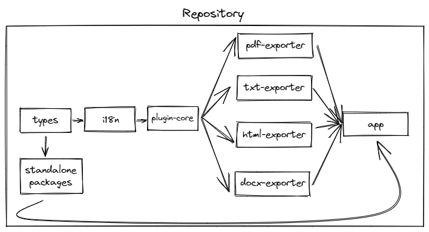

# Tooling

When the project perspective began to expand, the need to bring a robust tooling consistent with the proposal became evident. Using the best that Typescript can offer, the choice of **Vue**, **Vite**, **WindiCSS** and **Yarn Yorkspaces** was decisive and necessary.

## Monorepo

This architecture was adopted halfway through the project's development, necessitated by new tools attached directly to the application and the lack of a plugin system for the internal application, limiting large amounts of code to the framework's hook.

To create a satisfactory development and production sequence with [Yarn Workspaces](https://classic.yarnpkg.com/lang/en/docs/workspaces/) and [Lerna](https://lerna.js.org/) were chosen. The following is an example of the build sequence of the project as a whole.

### Monorepo Build Flow



> NPM packages go into the final bundle of vite, so they are not represented in the flow above.

## Vue

Choosing the `Vue` framework over others like `React`, `Angular`, `Svelte` was simple: the creator has a greater affinity with `Vue`, and because it is an extensive proposal, it was chosen mainly because of comfort and confidence.

### Code-Style

With the new features provided by `Vue 3.x`, dividing the application's activities into hooks allowed the adaptation of components much more independent of other components and better writing and control of the code. Due to its independence, each part of the application has its functionality only by its name, separated in the `hook's` schema. The division of features by hook follows the following idea:

- All uppercase definition for stores;

- All lowercase definition for hook`s.

- Functions in the rest of the current hook.

```ts
// store
const EXAMPLE = useExampleStore()

// hook
const example = useExample()

// functions
const onOpen = () => {
  example.open(EXAMPLE.options.open as boolean)
}
```

> As WindiCSS was chosen, the use of `<style>` was completely discarded from the `.vue` components.

> In the course of development, we had the migration from `Vue 2.x/Vuex` to `Vue 3.x/Pinia`. Because of this, some codes still follow the old pattern.

> Without much frills, the application uses as a rule the `tsconfig.json` recommended by the scaffolding of the template of `Vite + TS`.

### Components .vue Structure

```txt
  ├── components     #  .vue Default Components
  ├──── icons
  ├──── material
  ├──── page
  ├──── utils
  ├── pages          #  .vue Route Components
```

> Components are already globally imported into the application context.

## Vite and Ecosystem

[Vite](https://vitejs.dev/) is the big core of the application. Most of the tools and libraries implemented are in the vite plugins (not to be confused with the application's internal plugin system).

Check the implemented plugins in detail by [clicking here](https://github.com/Novout/betterwrite/blob/main/packages/better-write-app/vite.config.ts).

## Github Organizations

The application has its [own organization on github](https://github.com/betterwrite) with all the tools that are not directly part of the main repository, namely:

- **generi**: A Node.js CHANGELOG.md Generator;
- **vue-providers**: A simple collection of general-purpose directives for Vue 2/3;
- **pdfeasy**: A JavaScript Client/Server Side PDF-Generator based in PDFKit;
- **vue-pdfmake**: A PDFMake Plugin for Vue 3.x.

> **PDFEasy** was not used directly as it would require a complete refactoring of the PDF exporter, so it was preferred to keep **pdfmake** but with a specific plugin for `Vue`.